# freehire architecture

A user-facing tour of how freehire is built and how the features you use actually
work end-to-end. Aimed at contributors and curious users — pair with
[AGENTS.md](../AGENTS.md) for the contributor rulebook and [API.md](./API.md) for
the HTTP contract.

## At a glance

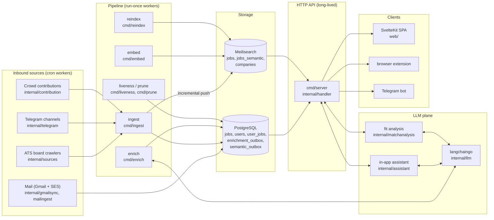

## The system in one paragraph

Cron-driven workers crawl dozens of ATS providers plus Telegram channels and
inbound recruiter mail, normalize every posting into one schema, dedup on
`(source, external_id)`, and write it to Postgres. An LLM enrichment queue
adds structured facets (skills, seniority, geography, work mode); a semantic
embedding queue vectorises postings for hybrid search. A long-lived Fiber
server serves a JSON API over Postgres + Meilisearch, consumed by the SvelteKit
SPA, a browser extension, and a Telegram bot. The same server hosts an in-app
AI assistant and an on-demand job-fit analysis chain — both running in-process
against shared services, no separate agent runtime.

## Stack

| Layer | Choice | Why |
|---|---|---|
| HTTP | Go + Fiber v2 | fast, minimal, handler-thin |
| DB | PostgreSQL + pgx | relationally correct, `ON CONFLICT` dedup |
| SQL gen | sqlc | typed queries from `internal/db/queries/*.sql` |
| Search | Meilisearch | typo-tolerant keyword + hybrid vector search |
| Embeddings | e5 model via Meilisearch | one engine, one index topology |
| LLM | langchaingo | provider-agnostic; configured by env |
| PDF | Typst CLI in sandbox | hermetic render, no system fonts |
| Frontend | SvelteKit | SSR + SPA, same-origin cookie auth |
| Design system | pnpm package (`design-system/`) | shared tokens, linked not copied |
| Infra | Docker Compose | one command up/down |

## Repository layout

```mermaid
flowchart TD
  Root["freehire/"]
  Root --> CMD["cmd/  — every binary"]
  Root --> Internal["internal/  — domain packages"]
  Root --> Migrations["migrations/  — sqlc + initdb source"]
  Root --> Sources["sources/  — YAML board files"]
  Root --> Web["web/  — SvelteKit SPA"]
  Root --> DS["design-system/  — pnpm package"]
  Root --> Docs["docs/  — this file, agent docs, API"]
  Root --> Services["services/  — standalone services (pii-filter)"]

  CMD --> CMDServer["server  — the only long-lived binary"]
  CMD --> CMDWorkers["ingest, enrich, embed, reindex,<br/>liveness, prune, notify, remind,<br/>tg-ingest, tg-extract, classify-mail, ..."]
  CMD --> CMDMigrate["migrate  — runs before schema changes"]

  Internal --> H["handler  — HTTP routes"]
  Internal --> P["pipeline, sources  — ingest + dedup"]
  Internal --> E["enrich, embed  — LLM + vector queues"]
  Internal --> S["search  — Meilisearch"]
  Internal --> A["accounts, auth, userjob  — identity + tracking"]
  Internal --> CV["cv, cvedit, resumeextract,<br/>experience, cvmatch  — CV toolchain"]
  Internal --> AI["assistant, matchanalysis, llm  — AI plane"]
  Internal --> M["mail stack, notify, reminder  — inbound + outbound"]
```

Every `cmd/<name>` except `cmd/server` is a **run-once-and-exit** worker driven
by cron, not a daemon. They need `DATABASE_URL` and exit non-zero on failure.
Source files under `sources/*.yml` are YAML board files (not Go) — one per ATS
provider, plus `custom.yml` and `telegram.yml`.

## Ingest → search pipeline

The path a job takes from "first seen on a careers page" to "searchable in the
SPA", with the workers that touch it.

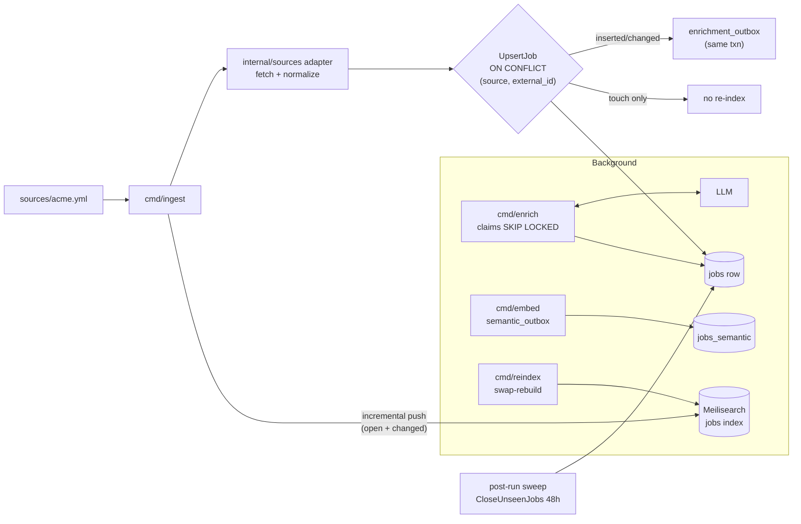

Key invariants:

- **Dedup key** is `jobs.UNIQUE (source, external_id)`; `external_id` is scoped
  to its board, so two boards never collide.
- **Incremental search push** uses `jobs.content_hash`; an upsert that only
  bumps `last_seen_at` is not re-pushed, so the whole catalogue isn't
  re-indexed every crawl. The full `cmd/reindex` stays the source of truth.
- **Enrichment** is a transactional outbox: the job is enqueued in the same
  txn that wrote it. `cmd/enrich` claims rows `FOR UPDATE ... SKIP LOCKED`,
  calls the LLM, runs `Sanitize` + `Validate`, and writes back to
  `jobs.enrichment` + deletes the outbox row in one txn.
- **Job lifecycle never deletes.** Closing is a soft `closed_at` column written
  by three mechanisms (ingest sweep, stream-driven self-close, liveness probe).
  `cmd/prune` is the only hard-delete path, and it archives to `pruned_jobs`.

## Feature flow: finding jobs

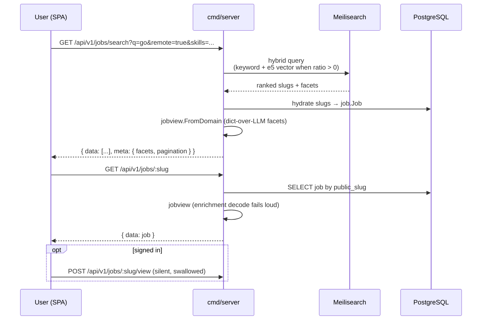

- `GET /jobs/search` is the workhorse: hybrid keyword + semantic over the
  `jobs` and `jobs_semantic` indices. Facets (`skills`, `regions`,
  `work_mode`, `seniority`, `category`, `yc_*`) come straight from Meilisearch.
- `GET /jobs/:slug` is the detail page; it never writes a counter — view
  counts come from parsed nginx logs offline via `cmd/rollup-views`.
- A signed-in view is recorded silently; failure is swallowed so it never
  breaks the page.
- Saved searches (`POST /me/searches`) drive `cmd/notify`, which groups
  subscriptions sharing a query so the index is hit once, not per subscriber.

## Feature flow: tailoring your CV

The CV toolchain is the densest part of the codebase. Five packages cooperate:
`internal/cv` (CRUD + render), `internal/cvedit` (the only writer), 
`internal/resumeextract` (LLM parse of stored CV), `internal/experience`
(durable achievement bank), `internal/cvmatch` (deterministic score), and
`internal/matchanalysis` (the AI fit chain).

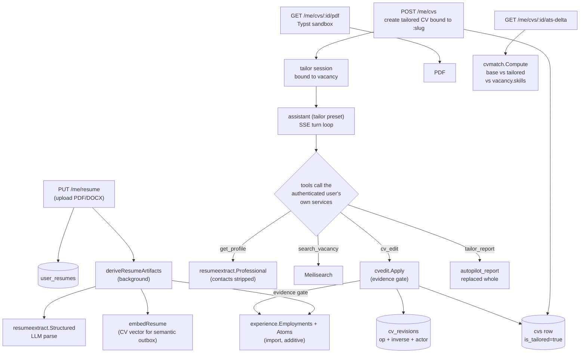

Key rules the diagram encodes:

- **`cvedit` is the only writer.** Every change — manual keystroke, agent edit,
  undo, autopilot — becomes a revision with op + inverse + actor + entry point.
- **The evidence gate.** The agent may not write a bullet/claim with no
  `evidence_id` from the bank; one uncited op refuses the whole batch. The
  check lives in the service path, not the prompt.
- **Provenance decides publication.** `cv_import`/`stated_in_chat`/`manual`
  (candidate-asserted) may reach a CV; `agent_inferred` (model) may not until
  re-stamped. Unknown provenance fails closed.
- **`is_tailored` is a creation fact**, not a pointer — `cvs.job_id` is
  `ON DELETE SET NULL` so a pruned vacancy doesn't orphan the CV.
- **Autopilot is cookie-only** because it rewrites the CV without being asked;
  it snapshots the document before the turn and refuses anything but a tailoring
  session (409 otherwise). Undo restores the pre-run document.
- **ATS delta** scores the rendered text layer of base vs tailored against the
  vacancy's `jobs.skills`. Cookie-only is the enforcement — keeps the score
  away from an agent being measured against it.

## Feature flow: AI fit analysis

On-demand, cached, three-stage LLM prompt-chain per `(user, job)`. Fixed
prompt-chain (not an autonomous agent), deterministic, typed, cacheable.

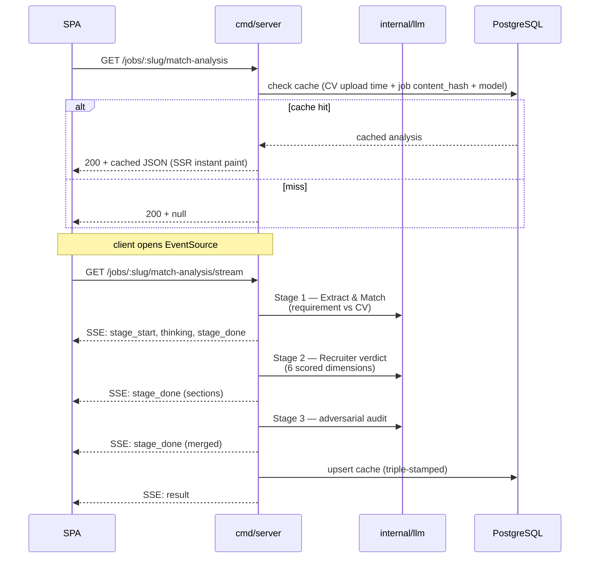

- Candidate context sent to the model is `resumeextract.Professional`
  (contacts stripped) — raw CV text never leaves the server.
- All model output is sanitized to controlled vocab (prompt-injection guard
  for untrusted `description`/`company_info`).
- `GET /jobs/:slug/fit` is an alias; the SPA uses `/match/[slug]/` with SSR
  for instant paint and `EventSource` for the live chain.
- **`cvmatch` is separate and deterministic** — dictionary-only scoring of a
  tailored CV against its bound vacancy, recomputed after every saved edit.
  The one rule: an unverifiable input leaves the denominator, never the
  numerator.

## Feature flow: in-app assistant

A bounded tool-calling loop in-process, streamed over SSE. No external runtime,
no shell, no credential minted for the agent — the tool receives the session
owner's `userID` and calls the same Go services the handlers do.

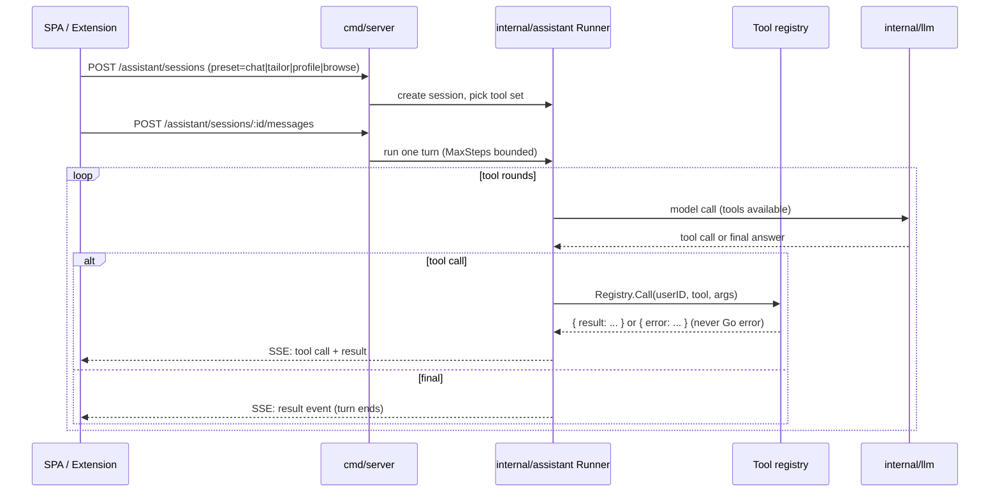

- `Registry.Call` never returns a Go error — unknown tool / bad args / failing
  service → `{"error": "..."}` so the model can self-correct.
- Presets (`chat`/`tailor`/`profile`/`browse`) are pinned by a CHECK constraint
  on `assistant_sessions.preset`; the preset selects the system prompt and
  the registered tool set.
- `read_current_page` (browse preset only) is the only tool that leaves the
  process — it drives the caller's browser through the
  [internal/browsertools](../internal/browsertools/AGENTS.md) relay.
- **Autopilot** (`POST /assistant/sessions/:id/autopilot`, cookie-only) walks
  every requirement in one turn with a raised ceiling (30 rounds) and a
  server-owned brief, snapshotting the CV first.

## Feature flow: per-user job tracking

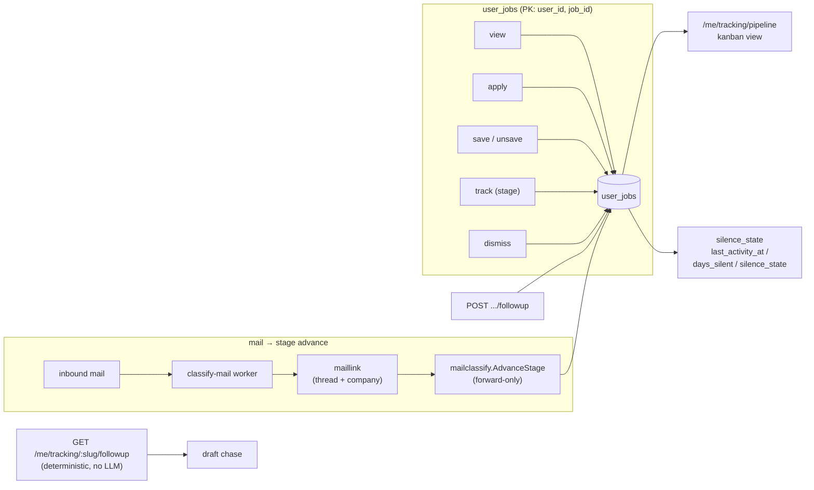

- `stage` is a controlled vocabulary:
  `applied/screening/responded/interview/offer/accepted/rejected/withdrawn`.
- The silence marker is null together or set together — null means "nothing
  owed here", which the board must tell apart from "answered promptly".
- `MarkApplied` takes `LockJobForApply` to serialize `applied_count` increments.
- The mail-driven stage advance is **forward-only** and matches on thread
  continuity + company name — never on sender-address domain (ATS relay
  domains would explode false positives).

## Auth model

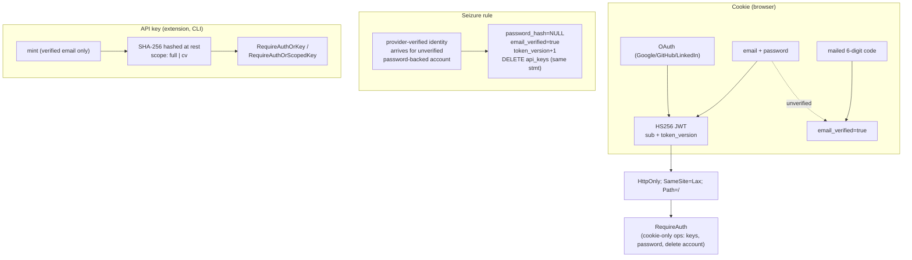

- JWT carries `token_version`; every credential change bumps it, stranding
  every issued token. `tv` load **fails closed** (kills deleted-account sessions).
- API keys are deliberately outside the session generation — a `token_version`
  bump does NOT revoke them. That's correct for "sign out everywhere" and wrong
  for a takeover, so the seizure and the mailed-code password reset delete the
  key rows in the same statement.
- Cookie-only operations (key management, password change, account deletion)
  stay cookie-only — the extension JWT does not reach them.
- The browser-extension connect flow issues a session JWT via a 302 to
  `redirect_uri#token=…` (fragment, never query), bounded by
  `EXTENSION_REDIRECT_ALLOWLIST`.

## Notifications

Two engines, two channels, both run-once cron workers.

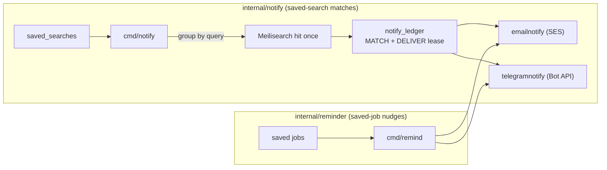

- `DigestJob` carries no internal job id (only public slug + URL) — the digest
  is safe to log.
- Unconfigured channel = soft-skip (`ErrChannelNotConfigured`), not failure.
- Matching is O(distinct queries), not O(subscribers).

## Job lifecycle (no deletes here)

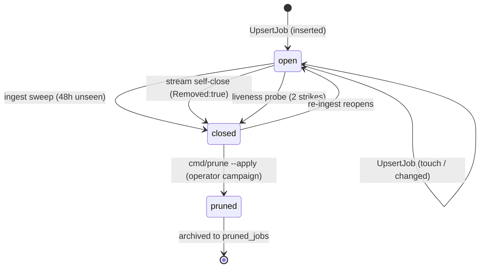

- Closing is soft (`closed_at`); a closed row keeps `public_slug`, enrichment,
  and `user_jobs` references — reopens for free.
- `cmd/prune` is the only hard-delete path, operator-driven, archives to
  `pruned_jobs`. Three rules (`title` / `business_at_nontech_company` /
  `unknown_at_empty_company`) gated on board presence/absence.

## Where to read next

- [AGENTS.md](../AGENTS.md) — the contributor rulebook and full module table.
- [API.md](./API.md) — the HTTP contract (generated, don't edit by hand).
- [docs/agents/](./agents/) — per-subsystem deep dives:
  [mail-stack](./agents/mail-stack.md), [notifications](./agents/notifications.md),
  [job-lifecycle](./agents/job-lifecycle.md), [company-facets](./agents/company-facets.md).
- Each substantial `internal/<domain>/` carries its own `AGENTS.md` — read it
  before touching that package.
